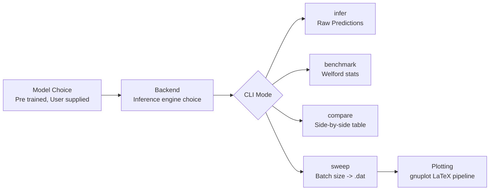
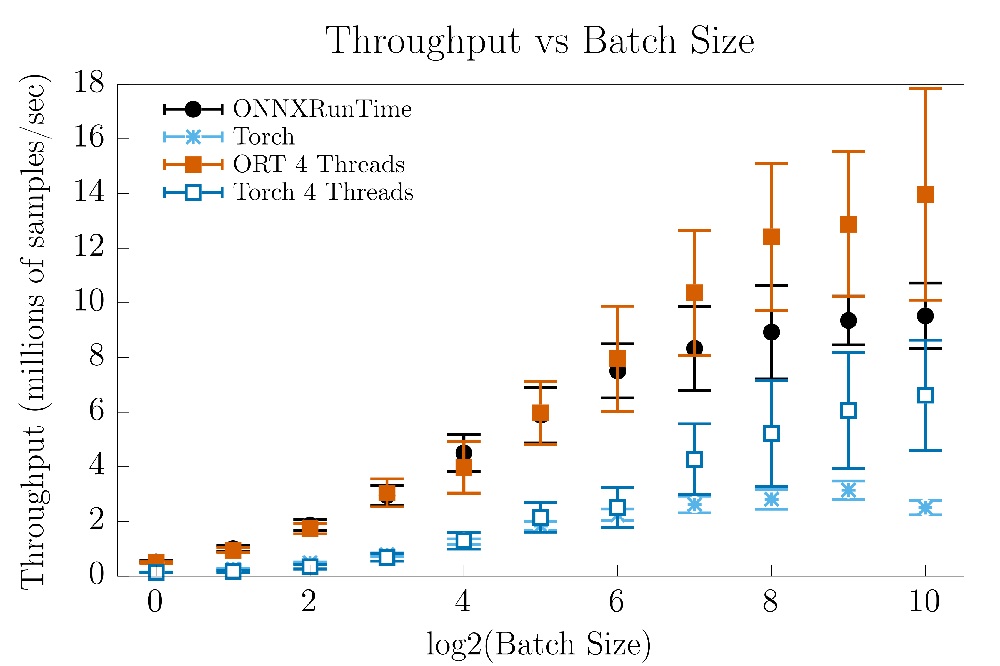
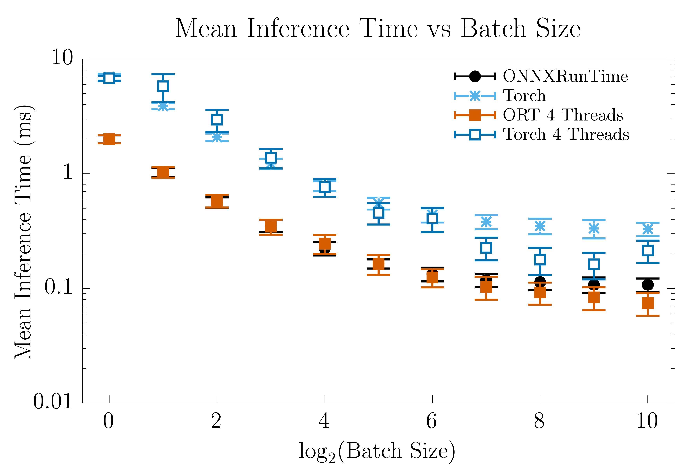
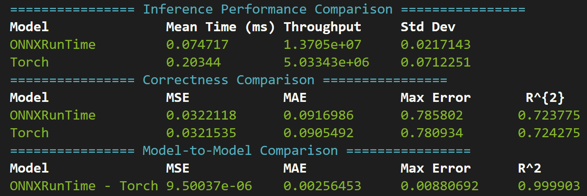

# Inference Profiler Engine 

A lightweight CLI for profiling, benchmarking and comparing different ML inference backends in C++; designed for performance critical environments where Python is not a viable option at runtime. There are four main modes to this CLI:

1. Inference - Runs one instance of inference through the chosen model on the given input data.
2. Benchmark - Benchmarks inference performance for the chosen model and input data. Reports average inference time, standard deviation, throughput, and other related statistics with a user supplied number of iterations (defaults to 1000).
3. Compare - Runs 2 different inference engines side by side and cleanly writes comparison tables to `std::cout`.
4. Sweep - Runs the given engine across different batch sizes; quantifies throughput, mean time for inference, etc. Used in many output plots; outputs `.dat` files for quantities as a function of batch size.

The main backends this was initially developed with were ONNX Runtime (ORT) and LibTorch in their C++ APIs. 

For example, if you want to run inference using the ORT backend with 4 threads, a batch size 26, using the model file `~/data/test.onnx` one would run the command 

`./backend_profiler -t 4 --batch-size 26 -m ~/data/test.onnx infer -b onnx`,

or to compare ORT to LibTorch with all other default options 

`./backend_profiler compare -b onnx -b torch`.

For the main results plots in this repository, we use the included models. These models are from my [PyTorch → ONNX → C++ Inference Pipeline](https://github.com/ksalamone59/pytorch-onnx-cpp-pipeline), and are intentionally very simple so that the engineering trade-offs and backend comparisons remain the focus rather than the model itself. They were trained to help learn the function $f(x)=\sin(x)e^{-0.1x^2}$. 

## Workflow

## Key Results

### Mean Throughput vs Batch Size


### Mean Iteration Time vs Batch Size


Both plots tell a similar story: ONNX Runtime, for C++ inference on this simple model, outperforms LibTorch at the same thread count. The number of data points for these plots is 1024 (so at max batch size, the entire dataset is used in one batch).

At smaller batch sizes, single-threaded and four-threaded ORT performance is fairly comparable. However, at a batch size of 64, the threaded version clearly starts winning. However, in both cases, the threaded versions have much higher standard deviations. This is expected, as multi-threaded execution introduces thread synchronization overhead and scheduling non-determinism that single-threaded execution avoids entirely.

LibTorch throughput degrades past batch size 512, likely due to cache pressure as the input tensor exceeds cache capacity. ORT is more resilient to this, potentially indicating more cache-friendly memory access patterns in its execution engine.

These results are highlighted in the table below for a batch size of 1024 (maximum in sweep plot above).

| Backend | Mean Time (ms) | Std Dev (ms) | Throughput (millions of samples/s) | $\sigma$ Throughput (millions of samples/s) |
|---|---|---|---|---|
| LibTorch | 0.409 | 0.043 | 2.506 | 0.266 |
| LibTorch: 4 Threads | 0.155 | 0.047 | 6.621 | 2.018 |
| ONNX Runtime | 0.108 | 0.010 | 9.525 |  1.200 |
| **ONNX Runtime: 4 Threads** | **0.073** | **0.020** | **13.976** | **3.875** |

*Results at batch size 1024. Full sweep shown in plots above.*

Shown below is a screenshot from the terminal output on the default model and random data comparison of LibTorch and ORT with 4 threads and a batch size of 1024. 



The output showcases model-to-model $R^{2}=0.9999$, confirming numerical equivalence between LibTorch and ORT backends. The lower $R^{2}$ values here when compared to the [original repository](https://github.com/ksalamone59/pytorch-onnx-cpp-pipeline) arise because in that repository the $R^{2}$ value is calculated with respect to the true function, here it is computed with respect to the noisy input data.

## Engineering Design Choices
- **Single Creation/Instantiation of Input Data:** `InputProvider` class creates the input data only once using either a fixed RNG seed (42), or the given input file. This class, along with the rest of the codebase where applicable, makes use of `std::span<const T>` to provide lightweight views into the underlying data.
- **Meyers Singleton:** pattern in `onnx_model.h` to mitigate repeated construction overhead.
- **Abstraction:** Pure virtual abstract `IBackendBase` class for clean interface with all models. This allows for clean abstraction while allowing new backends to be added with minimal effort. Templating everywhere applicable for a concept of only accepting Arithmetic types into the backend.
- **Accuracy Metrics:** `comparator` class handles accuracy calculations (MSE, MAE, $R^{2}$) using `metrics` namespace. In comparison mode, it also reports accuracy metrics from each model relative to the truth data as well as to one another.
- **Welford Online Variance:** Welford's online variance calculation in `benchmarker` class for mathematically stable single-pass variance and standard deviation calculation while avoiding  $\mathcal{O}(n)$  memory usage.
- **Input Tensor Reuse**: All models allocate their input tensors once at creation and, via `std::memcpy`, avoid heap allocation on the hot path.
- **Median Aggregation in Sweep Mode:** In sweep mode, 10 iterations at each batch size are run for consistency purposes. We then take the *median* average time and standard deviation, and use those values to calculate throughput. 
- **Model Warmup in Benchmarking:** Before timing begins, several warmup iterations are run to populate CPU caches with model weights and input buffers, allow ORT's memory arena to initialize, and ensure thread pools are fully spun up. This prevents cold-start effects from contaminating benchmark statistics.
- **Enums and Transformer Maps for CLI Inputs:** Allows for multiple different CLI inputs, based on user preference from list, to correspond to the same backend through an enum-to-backend map.

## Future Extensions 
- **CUDA Support:** Currently, only CPU inference is supported. CUDA inference support is the logical next step.
- **More Backends:** Currently supports the ONNX Runtime C++ API and LibTorch C++ API for CPU inference; extending support to additional backends (TensorRT, Keras, etc.) would be straightforward.
- **Different Data Types:** As mentioned, we define a custom concept in `custom_concept.h` that forces all data to be an arithmetic type. However, we only benchmark for float here. Quantization studies as well as precision studies (doubles vs int8, etc) would be fascinating here.

## Run Time Options
Command: `./backend_profiler GLOBAL_OPTIONS SUBCOMMAND SUBCOMMAND_SPECIFIC_OPTIONS`
- `GLOBAL_OPTIONS`:
    - `-o, --output`: Output `.dat` file. Defaults to `results.dat`
    - `-t, --num-threads`: Number of threads to use. Defaults to 1
    - `--batch-size`: Batch size for inference. Not used in sweep mode
    - `-i, --input-file`: Input file for the model if you have pre-generated data. If not given, random data is generated for default model 
    - `-n, --num-iterations`: Number of benchmark iterations for statistics accumulation. Defaults to 1000
    - `-h, --help`: Print help screen with all options
    - `-m, --model-path`: Path to ML model for inference *without extension*. Default: `../model_files/function_model`. Extension is set by the backend.
- `SUBCOMMAND`: Same 4 as described in introduction
    - `infer`: Run one iteration of inference on input data. Outputs results to `.dat` file. Requires one `-b` argument.
    - `benchmark`: Benchmark results on input data over `--num-iterations` iterations. Outputs results to `std::cout`. Requires 1 `-b` argument.
    - `compare`: Compare two models on inference and correctness. Outputs results to `std::cout`. Requires 2 unique `-b` arguments.
    - `sweep`: Runs benchmarking across multiple batch sizes and outputs results to `.dat` file. Will require one `-b` argument.
- `SUBCOMMAND_SPECIFIC_OPTIONS`:
    - `-b, --backend`: Selects the backend used for inference. Always expects 1 unless running compare mode: then expects 2. Run `./backend_profiler <subcommand> --help` to see options in an enum map. 
## Repository Layout
```plaintext
├── cpp/
│   ├── src/
│   └── include/
├── model_files/
├── Plotting/
├── external/
│   └── CLI11/
├── CMakeLists.txt
├── Makefile
└── test_input.dat
├── throughput_per_batch.png
├── time_per_batch.png
├── requirements.txt
└── LICENSE
```
- `cpp/src/`: Backend implementations (`onnx_model.cpp`, `torch_model.cpp`, `main.cpp`), CI testing file (`ci_testing.cpp`)
- `cpp/include/`: Headers (`backend_base.h`, `benchmarker.h`, `comparator.h`, `metrics.h`, `data_provider.h`, etc.)
- `model_files/`: Pre-trained `.onnx` and `.pt` model files
- `Plotting/`: [gnuplot-latex-utils](https://github.com/ksalamone59/gnuplot_latex_utils) submodule for sweep output plots
- `external/CLI11/`: CLI11 header-only library
- `Makefile`: Convenience wrapper around CMake build commands and repository  via `make clean`
- `test_input.dat` Test input data file for CI testing.
- `*.png`: output figures used in README.

## Dependencies 

**C++:**
- C++20 or later
- CMake ≥ 3.12
- [ONNX Runtime C++ API](https://github.com/microsoft/onnxruntime)
- [LibTorch C++ API](https://pytorch.org/cppdocs/)

CLI11 is included as a submodule — no separate install needed.

**Build:**
```bash
git clone --recurse-submodules git@github.com:ksalamone59/inference-profiler.git
make ORT_DIR=/path/to/onnxruntime TORCH_DIR=/path/to/libtorch
```

**Plotting:**
- gnuplot
- pdflatex

See [gnuplot-latex-utils](https://github.com/ksalamone59/gnuplot_latex_utils) for details.